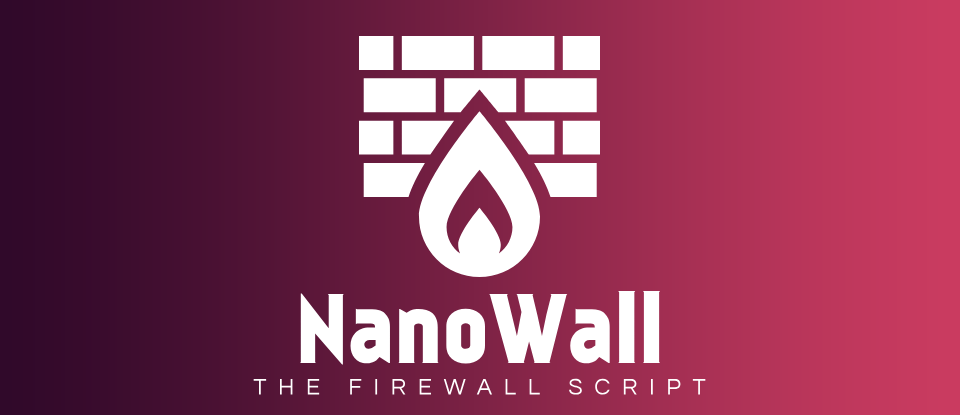

# NanoWall
<div align="center">

A simple Powershell script to manage outbound connections
<br/>
<a href="https://discord.gg/5uussSfQtu">Discord</a>

</div>

## 💎 About

**The Firewall Script**

NanoWall is not a firewall application. It's a PowerShell script that analyzes Windows Firewall blocked connection events and prints commands to create firewall rules for applications that do not already have them.  
Works best when combined with the Windows Firewall set to block all Outbound connections.

## 📖 How to Use

### Basic Usage
```powershell
powershell .\nanowall_windows.ps1
```

### With Custom Date Range
```powershell
# Last 30 days  
powershell .\nanowall_windows.ps1 -Days 30
```

### Get Help
```powershell
powershell .\nanowall_windows.ps1 -Help
```

## 🎚️ Parameters

| Parameter | Type | Default | Description |
|-----------|------|---------|-------------|
| `-Days` | int | 14 | Number of days to search back for events |
| `-Help` | switch | - | Display help message and exit |

## 🧬 How It Works

1. **Firewall Rules**: Retrieves all enabled outbound firewall rules
1. **Event Retrieval**: Gets blocked connection events from Windows Security log
1. **Filtering**: Keeps only events with 'Default Outbound' or 'Query User Default' origins
1. **Rule Comparison**: Excludes events for applications that already have firewall rules
1. **Output Generation**: Lists events and provides PowerShell commands to create rules

## 📄 Sample Output

```
~~ NanoWall ~~
Building volume to drive letter mapping...
Volume mapping complete. Found 2 volumes.
3 : C
4 : D
Getting outbound firewall rules...
Getting recent blocked firewall events...
Searching events from 9/1/2025 12:00:00 AM to now (14 days)...
Filtering events...
Found 15 events with relevant FilterOrigin.
Found 8 events without existing firewall rules.

Time: 9/15/2025 10:30:15 AM | Application: C:\Program Files\App\app.exe | FilterOrigin: Default Outbound

Commands to block outbound traffic for each unique application:

## C:\Program Files\App\app.exe

$ New-NetFirewallRule -DisplayName 'app.exe' -Direction Outbound -Action Allow -Program 'C:\Program Files\App\app.exe' -Enabled True

$ New-NetFirewallRule -DisplayName 'app.exe' -Direction Outbound -Action Block -Program 'C:\Program Files\App\app.exe' -Enabled True
```

## 📝 Requirements

- (Recommended) Set Windows Firewall to block all Outbound connections
- Administrator privileges (required to read Security event log)
- PowerShell execution policy allowing script execution

## 📜 License

This project is licensed under the GPL v3 - see the [LICENSE](LICENSE) file for details.
